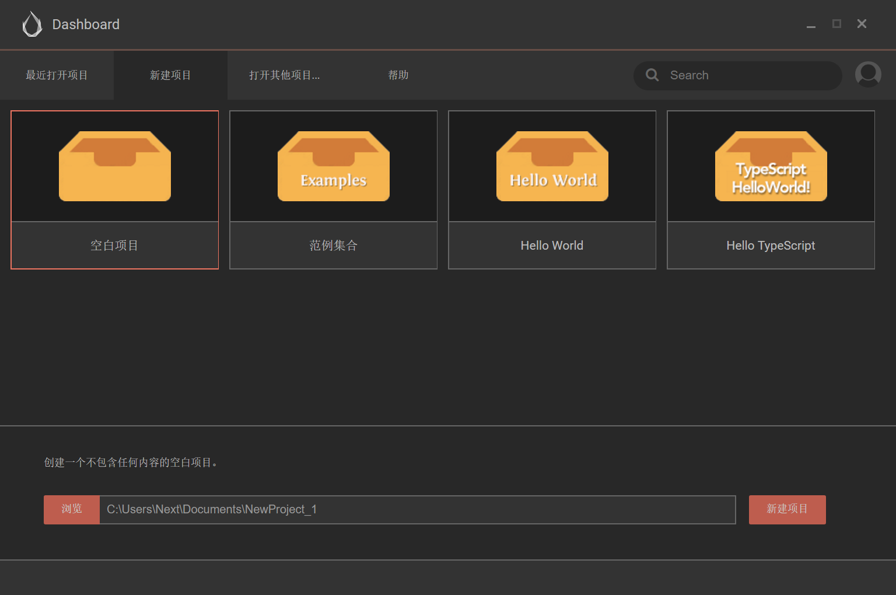

# Cocos Creator
简介什么的，最没意思了。

### 安装
http://www.cocos.com/download

!> Windows 安装过程中会询问是否安装 Visual Studio，其作用是编译 Windows 程序，我们暂时以 Web 平台开发为主，所以可以先跳过不安装，当然你非要安装我也不能拿你怎么样。

### 注册账号
如果你第一次使用 Cocos Creator，会提示你登录账号。你可以从下面的地址注册 Cocos 开发者账号。

https://passport.cocos.com/auth/signup

### Dashboard

- 空白项目：自己做游戏选择这个。
- 范例集合：官方的一些组件用法参考，有很多文档没有的内容，没事看一下。
- Hello World：自带一个场景，一个脚本，两张图片，可以用来做测试工程。
- Hello TypeScript：同上，这个为 TypeScript 脚本。

----
# Visual Studio Code
如果你有偏爱的编辑器也可以继续使用，但是 VS Code 与Cocos Creator 结合的更好。

### 安装
https://code.visualstudio.com/

----
# Chrome
浏览器通常是我们的调试场景，所以建议统一用Chrome。

### 安装
https://www.google.cn/chrome/
> 吃惊地发现下载谷歌浏览器竟然不用翻墙了。。。

----
# TypeScript
”我能不能用JavaScript啊？"

"不能。"

### 学习TypeScript
如果你没有接触过TS，也不用担心，你只要有一门语言的基础，入门别的语言其实很简单。你可以先看一下官方文档，然后跟着教程做一个游戏，遇到不会的地方搜索提问、搜索，如此循环即可。

?> https://www.tslang.cn/docs/home.html

