# 概览
这一节我们先不做游戏，熟悉一下Cocos Creator。

首先选择Hello TypeScript，新建一个工程。

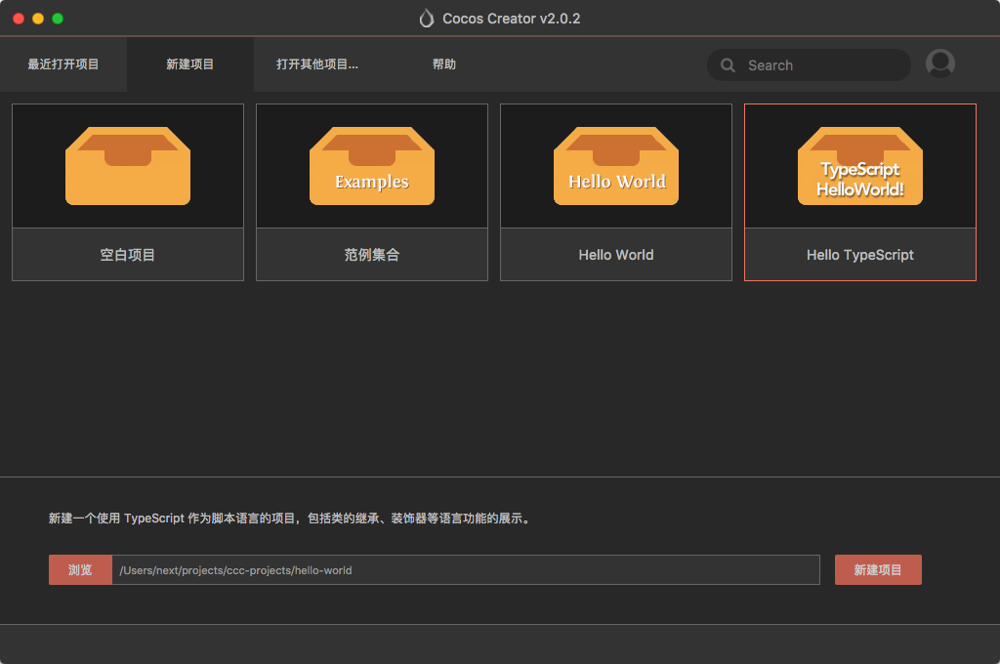

不出意外的话你就会看到这个界面

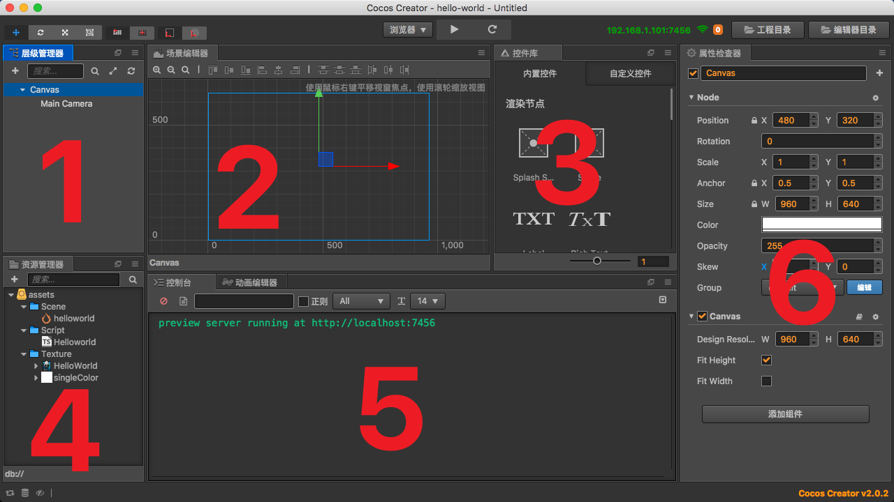

|序号|名称|功能|备注|
|---|---|---|---|
|1|层级管理器|显示场景中的节点层级关系|-|
|2|场景编辑器|预览场景效果|-|
|3|控件库|一些常用的可视化控件|个人来讲基本不用，我会把这个面板隐藏掉|
|4|资源管理器|存储游戏资源|-|
|5|控制台|输出系统和游戏信息|-|
|6|属性检查器|显示节点属性|-|

> 当然你可以随意调整各个面板的位置，或者隐藏掉。

关于资源管理器你可能还需要知道：

- Scene文件夹下的helloworld是一个场景文件，里面包含着一个游戏场景的相关信息，你可以双击打开它，进入对应的场景编辑界面。
- Script文件夹下Helloworld是一个脚本文件，里面包含着游戏逻辑，脚本通常会挂在节点上。
- Texture文件夹下存放着两张图片叫做贴图资源，你可以直接将其拖入场景编辑器或层级管理器使其变为场景中的一个带有Sprite组件的节点。

简单介绍一下场景（Scene）、节点（Node）、组件（Component）的关系：

> 学到后面你会发现游戏开发里的很多概念跟拍电影有些类似，游戏的场景可以简单的类比电影里的场景，场景里有角色有背景和一些“剧本”，还有对其拍摄的摄像机。

> 节点可以简单的理解为游戏中的物体载体，这个载体有位置有大小等基本信息，可能是玩家控制的角色，可能是天空中飘着的一段云，也可能是可以点击的一个按钮。

> 组件是游戏中最重要的一个概念，组件是赋予节点特殊能力的一个，额，一个东东。。。比如你可以在一个节点上添加Sprite组件使其显示一张图片，添加Label组件使其显示文字，添加Collider组件使其具有物理碰撞功能，还可以添加你自己写的用户脚本组件，使其具有特定的功能。

下面双击helloworld场景将其打开，你就会看到一个编辑好的场景

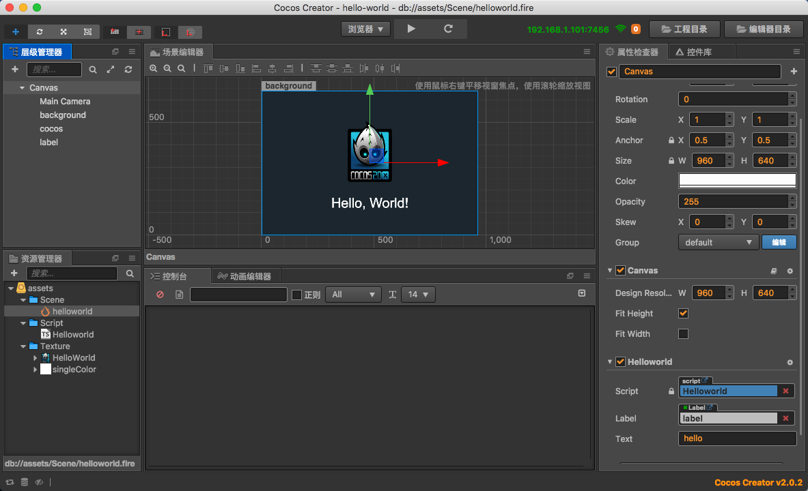

点击顶部的三角形播放按钮，即可在浏览器中看到游戏场景。

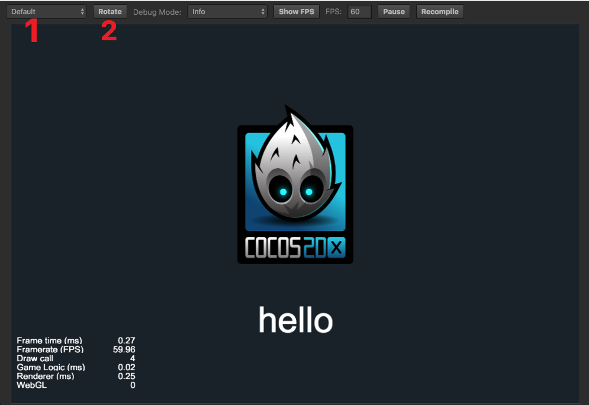

> 你可以在1处调整预览的设备型号，在2处调整设备方向。

现在再回过头来看一下场景的节点树结构。

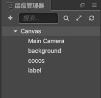

从上向下（你可以点击对应节点，在右边属性检查器查看节点属性）

- **Canvas**

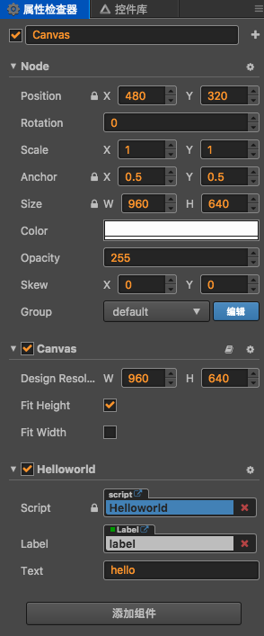

Canvas是每个场景的默认根节点，你不能删除，也不能移动，它在游戏运行时会根据你设定的屏幕分辨率和适配方式自动调整大小。可以看到Node下挂载的第一个组件就是Canvas组件，你可以在这里调整设计分辨率以及适配方式。Canvas下面还有一个Helloworld组件，这个其实是我们自己写的组件，对应着左边的Helloworld脚本，里面的脚步逻辑我们回头再看。

- **Main Camera**

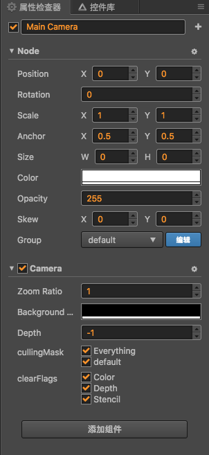

Main Camera也是每个场景都会有的，其作用是控制场景如何显示的。现阶段不用去修改它，后面我们会专门用一章来讲Camera。

- **background**

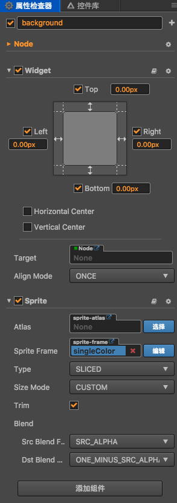

先看background下面的Sprite组件，可以看到Sprite里有一个Sprite Frame属性，你可以点击它，会发现它指向的是左边资源管理器里一张白色图片。可以看出Sprite组件就是用来让节点显示图片的。再看上面的Widget组件，应该很明显可以看出它是用来对其四边的，上下左右都是0，那么就可以让这个节点铺满屏幕。你可能又发现了这个背景在场景中显示的不是白色，颜色其实是在Node属性下设置的。

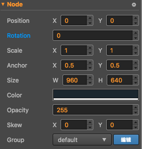

这里可以看出游戏中的一个物体其实是由节点和组件共同影响的。

- **cocos**

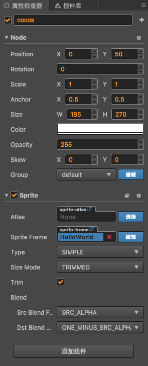

跟background一样是一个可以显示图片的节点（场景中间的Cocos图标），没有Widget组件，就不会有对齐效果，你可以任意调整其位置。

- **label**

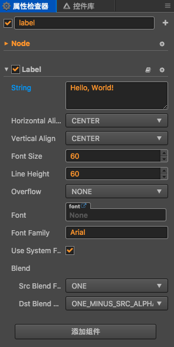

这个也很明显就是一个可以显示文字的节点，你可以修改Label组件下的String属性里的值来改变其显示的文字。

最后我们在回过头来看Canvas上的Helloworld组件，选中资源管理器的Helloworld脚本文件，可以在属性检查器里看到脚本内容。

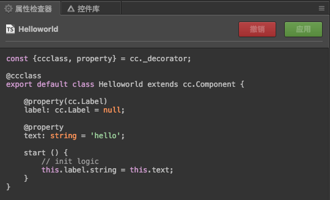

可以看到里面声明了两个属性：一个是label，其类型是cc.Label,label指向的就是场景中的label节点。另一个是text，其类型是string，并且默认值是‘hello’，你也可以在属性面板修改它的值。然后在start函数里将label的string改为text的值（start函数会在所有节点加载完成后自动执行）。

现在我们尝试一下修改脚本里的内容，但是打开脚本之前还有几个前提操作。将下图几个选项一次点一遍。

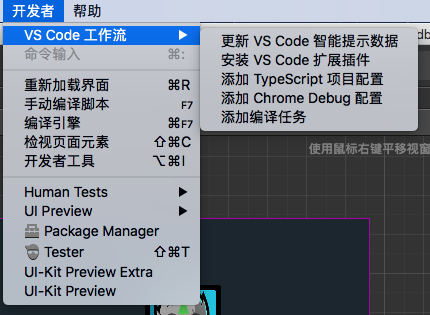

然后就可以双击脚本用 VS Code 打开了（Windows 系统默认会打开文件夹，但是 Mac 系统默认只会打开一个文件，暂时我还没找到解决办法，我通常会先打开 VS Code 然后选择工程文件夹再打开）。

打开脚本后修改在start里的内容如下：

```
start () {
    // init logic
    this.label.string = this.text;
    this.label.node.color = cc.Color.RED;
}
```

然后选中Canvas节点并且在右边的属性面板里更改text的值

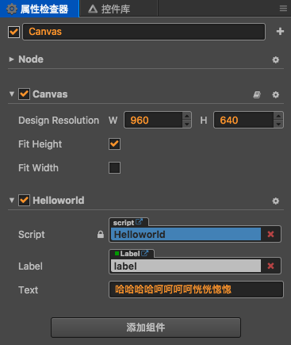

点击上方三角形运行按钮，即可看到下面效果

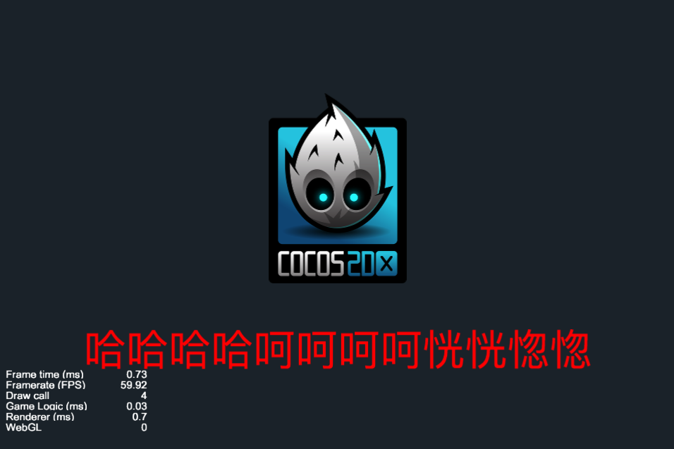

最后补充几点常用操作

|操作|步骤|
|---|---|
|新建场景|在资源管理器里右键选择新建->Scene|
|新建节点|在层级管理器右键创建节点，如果是带有图片的节点可以直接讲图片拖入场景或层级管理器中|
|添加组件|选中节点并在属性面板的最下方选择添加组件，或者直接讲用户脚本拖入属性面板|
|脚本属性绑定|将其对应类型的节点或带有组件的节点或资源拖入|
